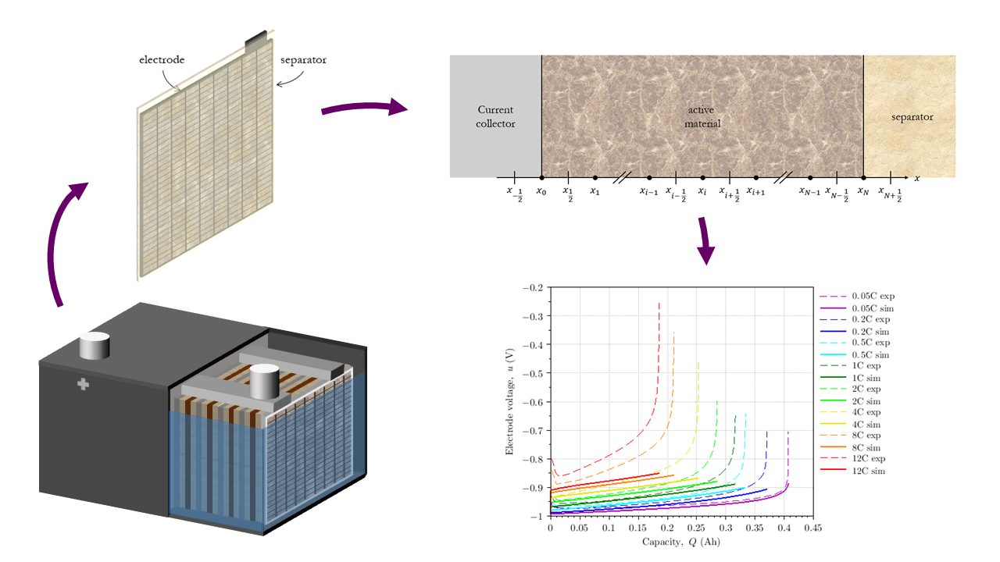
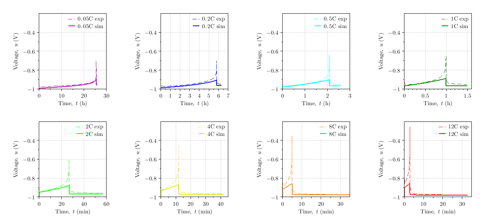

# NEOLAB

---

**Authors**: Mikaël Cugnet, Florian Gallois, Angel Kirchev, Denys Dutykh

**Last page update**: April 02, 2021

**Latest version**: 1.0

**Supported Scilab version**: 6.1.0

**Licence**: GNU Lesser General Public License (2.1)

---

Responding to the need of a growing community of students and researchers 
who wants to get involved in the field of electrochemical storage systems, 
NEOLAB offers a new tool dedicated to a modeling domain where almost no open-source solutions exist. 
Physics-based models of batteries require extensive knowledge in thermodynamics, electro-chemistry, mathematics, material and computer sciences. 
Based on the idea that a minimum working example is the best way to learn gradually how to model a battery, 
NEOLAB provides a solution to simulate the behavior of the negative electrode of lead-acid batteries 
and a framework to investigate other primary and secondary technologies.




A study to optimize the performance of the software has been carried out, in particular the impact 
of equations scaling. 
The toolbox consists of two Scilab routines, the main one in which are set up all the varibles, and a second one computating the residue of the equations.
The resolution of equations is done with a Scilab differential/algebraic system solver.


---

## Download and install
All the user needs to do is downloading the last version of Scilab (6.1.0) and open the main file. When compilling the program, 
the path to the residue function must be specified:  
```matlab
addpath /path/to/NEOLAB
``` 

The user has the choice to proceed the simulation with both dimensional and dimensionless methods.

---

## Problems or questions
If you have any problems or questions, please contact the author: Mikaël Cugnet (mikael.cugnet@cea.fr)

---

## Files and folders
| File/Folder | Description |
|----------|-------------|
| images  |  Folder of images |
| src  |  Source code folder |
| data  |  Folder of experimental data (in the folder *src*) |
| README.md  |  Basic information (this file) |
| Licence  |  Licence information |
| data.sod  |  Experimental data (in the folder *data*) |
| main_dassl_dim.sce  |  Main routine using dassl solver and dimensional method (in the folder *src*) |
| main_dassl_adim.sce  |  Main routine using dassl solver and dimensionless method (in the folder *src*) |
| main_dassl_dim_tol.sce  |  Main routine using dassl solver and dimensional method, with a tolerence study (in the folder *src*) |
| main_dassl_adim_tol.sce  |  Main routine using dassl solver and dimensionless method, with a tolerence study (in the folder *src*) |
| res_dassl_dim.sci  |  Residue function using dassl solver and dimensinal method (in the folder *src*) |
| res_dassl_adim.sci  |  Residue function using dassl solver and dimensinless method (in the folder *src*) |
| res_dassl_dim_tol.sci  |  Residue function using dassl solver and dimensinal method, with a tolerence study (in the folder *src*) |
| res_dassl_adim_tol.sci  |  Residue function using dassl solver and dimensinless method, with a tolerence study (in the folder *src*) |


---

## References
